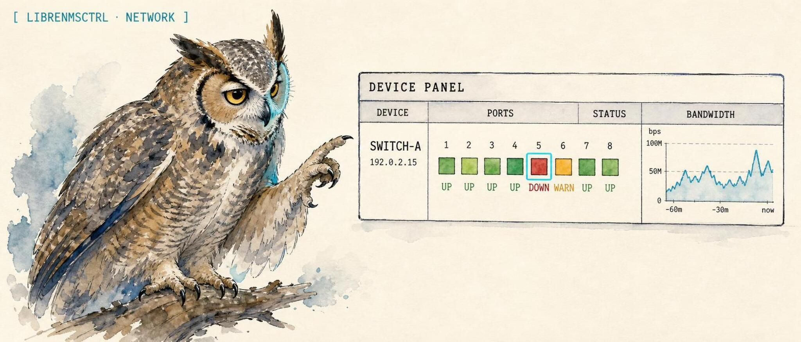

<p align="center">
  
</p>

<p align="center">
  <a href="https://lidless.dev"></a>
</p>

<h1 align="center">librenmsctrl</h1>

<p align="center">
  <strong>An operator control CLI for LibreNMS: inspect devices, ports, port health, alerts, and events over API-token auth, with an MCP adapter for agent workflows.</strong>
</p>

<p align="center">
  <a href="https://lidless.dev/librenms-mcp"><strong>Website &rarr; lidless.dev/librenms-mcp</strong></a>
</p>

<p align="center">
  
  
  
  
</p>

librenmsctrl is a local operator control CLI for [LibreNMS](https://www.librenms.org/), the open-source network monitoring system. It gives shells, cron, and CI a typed command surface for reading your monitored network: devices, ports, port health, alerts, alert history, and the event log over LibreNMS API-token auth.

The same package remains MCP-compatible for agent workflows. `librenmsctrl mcp` starts the stdio [Model Context Protocol](https://modelcontextprotocol.io) adapter, and the existing `librenms-mcp` binary continues to work for launchers and configs that already use it. The MCP adapter can acknowledge or mute alerts only when you pass an explicit `confirm: true`. It differs from pointing an agent at the raw LibreNMS REST API in one way that matters: every write is gated, every argument is schema-validated before it leaves the host, and your token is redacted from all output, so a hallucinated tool call cannot change your monitoring state by accident.

> **Status: work in progress.** v1 ships read tools (tier 1) and confirm-gated safe writes (tier 2) only. Destructive operations (tier 3) such as device deletion, alert-rule removal, and bulk port resets are intentionally deferred until the write-gate pattern has more field time. Treat it as early but usable; the read path and the two write gates are tested.

## What it does

librenmsctrl turns a [LibreNMS](https://www.librenms.org/) instance into a scriptable control surface for network monitoring and observability work: list the devices LibreNMS is polling over SNMP, pull a single device or port, check port health and utilization, read current alerts and alert history, and tail the event log. It authenticates with a LibreNMS API token, talks to the LibreNMS `/api/v0` REST API under the hood, and can emit human-readable tables or raw JSON for piping.

For MCP clients, the `mcp` subcommand exposes the same LibreNMS client core as structured tool output an agent can reason over. The package name is still `@solomonneas/librenms-mcp`, and the back-compat `librenms-mcp` bin is intentionally kept stable.

Writes are gated in three tiers:

- **Tier 1 (reads)**: open. No confirm flag. Status, device and port listings, single device or port, port health, alert listings, alert history, event log.
- **Tier 2 (safe writes)**: require an explicit `confirm: true` argument, documented on every write tool's JSON schema. Acknowledge an alert, unmute an alert, or put a device into a maintenance window. A tool call missing the flag throws `WriteGateError` before any HTTP traffic leaves the host.
- **Tier 3 (destructive)**: not implemented in v1. When added, ops like device deletion and alert-rule removal will additionally require `destructive: true`. The model cannot bypass either gate from a hallucinated call.

Every tool call is validated against its published TypeBox `inputSchema` before the tool runs. Ids, port ids, device ids, limits, and the `type`/`state` filters are bounds- and enum-checked, so a malformed or injection-style argument is rejected up front and never reaches a LibreNMS URL path or query string. Interpolated path and query values are additionally URL-encoded as defense-in-depth. The API token is registered with the redactor on startup and masked from all log and error output.

## Quickstart

Published to npm as [`@solomonneas/librenms-mcp`](https://www.npmjs.com/package/@solomonneas/librenms-mcp). Install the package to get the `librenmsctrl` operator CLI and the back-compat `librenms-mcp` MCP launcher.

```bash
# start the MCP adapter on demand through the back-compat `librenms-mcp` bin
npx -y @solomonneas/librenms-mcp

# install the global `librenmsctrl` and `librenms-mcp` binaries
npm install -g @solomonneas/librenms-mcp
```

It needs Node 20+ and two env vars, `LIBRENMS_URL` and `LIBRENMS_TOKEN`.

```bash
export LIBRENMS_URL=https://librenms.example.local
export LIBRENMS_TOKEN=<your-api-token>

librenmsctrl status
librenmsctrl alerts list --state 1
librenmsctrl --json ports health --metric errors_in --limit 10
```

The MCP adapter speaks stdio. A quick way to confirm it starts is to feed it an MCP `tools/list` request:

```bash
export LIBRENMS_URL=https://librenms.example.local
export LIBRENMS_TOKEN=<your-api-token>
echo '{"jsonrpc":"2.0","id":1,"method":"tools/list"}' | npx -y @solomonneas/librenms-mcp
```

You should get back a JSON listing of the 13 tools above. In normal use you point an MCP client at the same command instead.

## Tools

The MCP adapter exposes 13 tools: 10 reads, 3 confirm-gated safe writes. This list is generated from the server's tool registration in [`mcp-server.ts`](mcp-server.ts).

**Reads (10, open):**

| Tool | What it does |
|---|---|
| `librenms_status` | LibreNMS instance status check. |
| `librenms_list_devices` | List monitored devices. |
| `librenms_get_device` | Fetch a single device by id. |
| `librenms_list_ports` | List ports across devices. |
| `librenms_get_port` | Fetch a single port detail. |
| `librenms_port_health` | Port health and utilization view. |
| `librenms_list_alerts` | List current alerts. |
| `librenms_get_alert` | Fetch a single alert by id. |
| `librenms_alert_history` | Historical alert records. |
| `librenms_event_log` | Read the device event log. |

**Safe writes (3, require `confirm: true`):**

| Tool | What it does |
|---|---|
| `librenms_ack_alert` | Acknowledge an active alert by id. |
| `librenms_unmute_alert` | Unmute a previously muted alert. |
| `librenms_set_maintenance` | Put a device into a maintenance window. |

## Configuration

Set the following env vars. Both credential vars are required.

| Variable | Required | Default | Notes |
|---|---|---|---|
| `LIBRENMS_URL` | yes | - | Base URL of your LibreNMS instance. Trailing slashes are stripped. |
| `LIBRENMS_TOKEN` | yes | - | LibreNMS API token. Registered with the redactor on startup and masked from all output. |
| `LIBRENMS_TLS_INSECURE` | no | `false` | Skip TLS cert validation for homelab self-signed certs. Accepts `true`/`1`/`yes`, case-insensitive. |

## CLI

`librenmsctrl` is the read-only operator **control CLI** for shells, cron, and CI. It shares the LibreNMS client core with the MCP adapter and talks to the same `/api/v0` API over token auth. It exposes only the read tools (tier 1); the confirm-gated writes (`ack`, `set_maintenance`, `unmute`) are intentionally not surfaced in the CLI.

```bash
# installed globally as `librenmsctrl`, or via `npx -p @solomonneas/librenms-mcp librenmsctrl ...`
librenmsctrl status                       # instance health (exit 1 if no system data)
librenmsctrl devices list --type down
librenmsctrl devices get core-sw1
librenmsctrl ports list core-sw1
librenmsctrl ports get 42
librenmsctrl ports health --metric errors_in --limit 10
librenmsctrl alerts list --state 1        # 0=ok, 1=active, 2=ack
librenmsctrl alerts get 7
librenmsctrl alerts history --device-id 3 --limit 25
librenmsctrl events list --limit 50
librenmsctrl --json status                # raw JSON for piping
```

Run `librenmsctrl help` for the full flag list. It reads the same `LIBRENMS_URL`, `LIBRENMS_TOKEN`, and `LIBRENMS_TLS_INSECURE` env vars as the server. Exit codes: `0` success, `1` runtime error (LibreNMS unreachable, call failed, or `status` with no system data), `2` usage error (unknown command/flag or bad value).

### Starting the MCP server

`librenmsctrl mcp` (or the back-compat `librenms-mcp` bin) starts the stdio MCP server. If a launcher referenced the file path `dist/mcp-server.js` directly, point it at `dist/mcp-bin.js` (or `dist/cli.js mcp`); launchers that use the `librenms-mcp` bin name need no change.

## MCP client config

Copy-paste this into your MCP client. It is the canonical `mcpServers` shape used by Claude Desktop and Claude Code; both `LIBRENMS_URL` and `LIBRENMS_TOKEN` are required.

```json
{
  "mcpServers": {
    "librenms": {
      "command": "npx",
      "args": ["-y", "@solomonneas/librenms-mcp"],
      "env": {
        "LIBRENMS_URL": "https://librenms.example.local",
        "LIBRENMS_TOKEN": "<your-api-token>",
        "LIBRENMS_TLS_INSECURE": "false"
      }
    }
  }
}
```

### Claude Code

```bash
claude mcp add librenms -s user -- npx -y @solomonneas/librenms-mcp
```

Then export `LIBRENMS_URL` and `LIBRENMS_TOKEN` in your shell (`~/.bashrc`, `~/.zshrc`) or pass `--env` flags on the `claude mcp add` line.

### Claude Desktop

Add the `mcpServers` block above to `~/Library/Application Support/Claude/claude_desktop_config.json` (macOS) or `%APPDATA%\Claude\claude_desktop_config.json` (Windows).

### Codex CLI

`~/.codex/config.toml`:

```toml
[mcp_servers.librenms]
command = "npx"
args = ["-y", "@solomonneas/librenms-mcp"]

[mcp_servers.librenms.env]
LIBRENMS_URL = "https://librenms.example.local"
LIBRENMS_TOKEN = "<your-api-token>"
LIBRENMS_TLS_INSECURE = "false"
```

### OpenClaw

The plugin loads automatically once installed. Config goes in your `~/.openclaw/openclaw.json` under `plugins.entries.librenms` (or use the bundled `openclaw.plugin.json`):

```json
{
  "plugins": {
    "entries": {
      "librenms": {
        "package": "@solomonneas/librenms-mcp",
        "activation": { "onStartup": true }
      }
    }
  }
}
```

Env vars from `~/.openclaw/workspace/.env` are inherited by the plugin.

## Safety

This MCP uses a three-tier write-gating pattern:

- **Tier 1 (reads):** open. No confirm flag needed.
- **Tier 2 (safe writes):** require an explicit `confirm: true` arg. The JSON schema documents this on every write tool. A tool call without the confirm flag throws `WriteGateError` before any HTTP traffic.
- **Tier 3 (destructive):** not implemented in v1. When added, ops like device deletion, alert-rule removal, and bulk port resets will additionally require `destructive: true`.

**Input validation:** every tool call is validated against its published TypeBox `inputSchema` before the tool runs. Ids, port ids, device ids, limits, and the `type`/`state` filters are bounds- and enum-checked, so a malformed or injection-style argument (a non-integer id, an off-enum filter, an unexpected extra field) is rejected up front and never reaches a LibreNMS URL path or query string. Interpolated path and query values are additionally URL-encoded as defense-in-depth.

**API token scope:** start with a "Read Only" token role in LibreNMS (Settings > API > New API Token > Read Only) and verify the read tools work end-to-end. Grade up to "Normal User" or "Global Read/Write" only after you have confirmed the redactor is masking your token in your transcripts and that the model is honoring the confirm gate. Tokens can be revoked instantly from the same Settings > API screen.

**TLS:** the `LIBRENMS_TLS_INSECURE=true` toggle exists for homelab self-signed certs. Leave it `false` in any environment with a real CA-signed cert.

See [SECURITY.md](SECURITY.md) for the vulnerability-reporting policy.

## Why not just point an agent at the LibreNMS API?

You can hand an agent a generic HTTP tool and the LibreNMS API token, and for read-only exploration that works. The difference shows up the moment a write is possible:

- **No write gate.** A generic HTTP tool will happily `PUT` or `DELETE` whatever the model decides to send. librenms-mcp refuses every write unless the call carries `confirm: true`, and refuses destructive shapes entirely in v1.
- **No input validation.** A raw API tool passes whatever the model produced straight into a URL. librenms-mcp bounds- and enum-checks every argument against a published schema and URL-encodes interpolated values before any request is built.
- **Token leakage.** A generic tool echoes request and response detail, including your token, into the transcript. librenms-mcp registers the token with a redactor on startup and masks it from all log and error output.
- **Shaped tools beat one giant endpoint.** Thirteen named, described tools give the model a far better surface to reason over than one `call this REST API` tool with a free-form path argument.

## What librenms-mcp is not

- It is not a LibreNMS replacement or a poller. It reads an existing LibreNMS instance over the API; it does not collect SNMP itself.
- It is not a dashboard. Output is structured tool data for an agent, not a UI. For a NOC dashboard view, see [watchtower](https://github.com/solomonneas/watchtower).
- It does not delete devices, remove alert rules, or do bulk port resets. Tier-3 destructive operations are deliberately absent in v1.
- It is not a hosted service. It runs locally over stdio, talks only to the LibreNMS URL you configure, and starts no daemon.

## Contributing

Patches welcome. See [CONTRIBUTING.md](CONTRIBUTING.md) for what lands easily, [CODE_OF_CONDUCT.md](CODE_OF_CONDUCT.md), and the issue and PR templates under [.github/](.github). All public output should be scrubbed of personal hostnames, tokens, and real IPs.

## License

[MIT](LICENSE).

---

<p align="center"><a href="https://lidless.dev">Part of <strong>Lidless Labs</strong></a> &middot; the eye does not close</p>

<p align="center"><sub><strong>Network:</strong> <a href="https://github.com/lidless-labs/n8nctrl">n8nctrl</a> &middot; <a href="https://github.com/lidless-labs/watchtower">watchtower</a> &middot; <a href="https://github.com/lidless-labs/portgrid">portgrid</a> &middot; <a href="https://github.com/lidless-labs/cutsheet">cutsheet</a> &middot; <a href="https://github.com/lidless-labs/eero-cli">eero-cli</a></sub></p>

<p align="center"><sub><a href="https://lidless.dev">All tools</a> &middot; <a href="https://github.com/lidless-labs">Lidless Labs on GitHub</a></sub></p>
